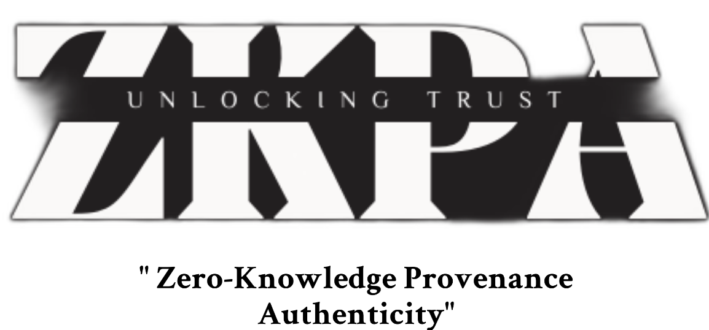

# ZKPA - Zero Knowledge Provenance Authenticity

This project is for 2024 ETH Golabal London Hackathon.

<table>
  <tr>
    <td>
      
    </td>
    <td>
      
    </td>
  </tr>
</table>

## Overview

ZKPA allows manufacturers to add a zk-proof to media metadata, enabling users and third parties to verify the origin and authenticity of the media. We use cryptographic signatures to create a chain of trust which ties the image to a trusted manufacturer of trusted and secure camera hardware, then use ZK to remove the intermediate signatures whilst maintaining the security properties. In other words, it conceals the signer identities, which could potentially be used to doxx its users. It's a viable means of mitigating deepfake misinformation -- social media could flag images that lack these camera proofs, and this will prevent people from being confused, since there can be no such proofs for images that did not come from this trusted hardware.

Crucially, we implement encrypted camera identifiers, such that only trusted parties can know the true signer identities. This allows one to blacklist malicious or hacked cameras. We're working on ways of ensuring that this is differentially private and abuse-proof.

This repo contains tools for the generation and verification of the signatures, and the scrubbing of the information with ZK. Signatures and proofs can be generated in CLI and verified on Web-UI or using Noir's inbuilt tools.

## Why, and How?

_Sections of this explanation were copied by the AIxCrypto Report, these of which were co-written and edited by Arbion._

On the 23rd of January, an AI-generated voice message falsely claiming to be President Biden discouraged Democrats from voting in the 2024 primary. Barely a week later, a finance worker lost $25 million to scammers through a deepfake video call mimicking his colleagues. On X (formerly known as Twitter), meanwhile, AI-created explicit images falsely attributed to Taylor Swift attracted 45 million views and sparked wide-spread outrage. These incidents, all taking place in the first two months of 2024, are only a snapshot of the diverse and damaging impact deepfakes can have across politics, finance, and social media.

Forgeries used to be easily detectable by eye, but deepfakes make it easy and cheap to create images almost indistinguishable from real photos. For example, the website “OnlyFake” uses deepfake technology to generate realistic photos of fake IDs in minutes for just $15. The photos have been used to bypass the anti-fraud safeguards, known as
Know-Your-Customer (KYC), on OKX (a crypto exchange). In the case of OKX, the deepfake IDs fooled their staff, who are trained to spot doctored images and deepfakes. This highlights that it is no longer possible to detect deepfake-based fraud by eye, even for professionals.

One solution is to detect malicious deepfakes once they’re in the wild instead of preventing their creation. But, deepfake-detecting AI models (such as those deployed by OpenAI) are becoming obsolete due to inaccuracies. Although deepfake detection methods have become more sophisticated, the techniques for creating deepfakes are becoming more sophisticated at a faster rate – the deepfake detectors are losing the technological arms race. This makes it difficult to identify deepfakes based on the media alone. AI is advanced enough to create fake footage so realistic AI itself cannot determine its inaccuracy.

Another solution is watermarks, used to identify deepfakes at the point-of-viewing. They can often be removed or forged with easy-to-use tools, thereby bypassing any watermark-based anti-deepfake solutions. They can also be removed accidentally: most social media platforms automatically remove them. More advanced tech, such as perceptual hashes, are vulnerable to adversarial attack and are thus low-reliably. The most popular implementation of deepfake watermarking technology is C2PA (by the Coalition for Content Provenance and Authenticity). It is designed to prevent mis-information by tracking where media comes from and storing this information in the media metadata.

We prefer hardware-attestation. Hardware-attested cameras embed a unique proof with each photo they take, certifying that it was taken by that specific camera. This proof is created by a non-cloneable, tamper-proof chip unique to the camera, ensuring the image's authenticity. This will be backed by trust in a signer authority, such as Sony (the camera manufacturer). They can certify camera signer identities using cryptographic signatures. A similar process can be used for audio and video. It's cheaper to hack software, but expensive to compromise secure chips -- that's why we do this. **The attestation proof tells us that the image is taken by a real camera, meaning we can usually trust that it is a picture of a real object. We can flag images which don’t have this proof -- guilty until proven innocent. unlike watermarks.**

The cryptographic signatures and metadata included within the C2PA water-mark and in hardware-attestation metadata can be linked to specific users or devices. In some cases, the C2PA metadata could link all images that your camera has ever taken to each other: if we know that an image came from someone’s camera, we can identify all other images which came from that camera. This could be used to deanonymize whistleblowers who have published images from their camera under their real names. There are additional issues, described in the AIxCrypto Report. Therefore, we will need to **scrub the sensitive information using ZK.**

However, total scrubbing of camera signer identities makes blacklists impossible. We need camera blacklists -- they enable social media platforms and apps to flag images which came from that particular camera which is known to have produced misleading images in the past, covering us in case of camera hacking and thereby massively heightening the cost of deepfake attacks. Since its so expensive, deceptive deepfakes could become rare, so we would have the means to deal with these edge cases via arbitration. Therefore, we **re-introduce these identifier in an encrypted form, such that only the members of a trusted consortium can access it.**

## The Step-By-Step

### 1. Camera Set-Up

Cameras generate keys used for signing on their secure enclave at their time of manufacture. They are also endowed with a certificate by their manufacturer -- a signed version of their own public key which demonstrates the camera's trustworthiness. This is a one-time set-up, the keys and certificate is re-used.

### 2. User Photo Capture

The camera, being trusted, allows users to capture photos, and signs them. It provides the signature and its own certificate of trust.

### 3. Proof Generation

The camera generates a signature for the photo, proving its genuineness, from the signature data, in ZK, and re-introduces the encrypted signer-identity. This data is saved in the image EXIF.

Note: attempts to tamper with the encrypted signer-identity will cause the proof verification to fail -- this is a vital security feature that we built into the proof circuits.

### 6. Verification

Users can verify the proof on-device. If it is correct and corresponds to an authority (such as Sony) that is in their trusted whitelist, the camera is taken to be authentic.

### 7. Querying or Modifying Blacklist

The encrypted identifier can be sent to the keepers of the blacklist, who will tell you if that camera has been blacklisted before. If you can convince them that the camera identity was used to sign a deepfake, such as in cases of hacking, they will use the encrypted identifier to add the camera identity to the blacklist.

## Technologies

- **Zero-Knowledge Proof (ZKP) Libraries**: Used for creating and verifying signatures without disclosing sensitive information. We used Noir.
- **Elliptic Curve Cryptography (ECC)**: Employed for securely generating and verifying Zero-Knowledge signatures.
- **Image Processing Libraries (IPL)**: Utilized for extracting data from photos, which is then used to generate ZK signatures.

## How To Test

### Web Front-End

WARNING: The frontend is almost functional, however proof verification could not be achieved due to bugs in NoirJS. We recommend inspecting the command-line utilities. It communicates with a Python Flask backend.

It runs on our Vercel, see https://zkpa.vercel.app

You can do `npm install` and `npm start` for local development.

### CLI Tools

See `circuit/scripts`. Both tools take the filename of an image, which must be stored in the same directory, as only single command-line argument.

`witnessGen.py` generates the information which one can pass to the prover to generate the proof from the circuit and prints it. Much of the code is used in our Flask backend to the web-app.

`proofGen.py` generates a proof from the stored witness information and adds the data to the EXIF of the input.

Any generated proofs can be verified with the standard Noir utilities.

**NOTE:** the proofs may fail when witness information is generated by `witnessGen.py`, since we can not generate ECDH keys on the BabyJubJub curve in Python yet. `deprecated/imageSig.py` generates valid data, but it uses hard-coded values and has not been updated according to the change in variable names.

## Limitations and Next Steps

### Limitations

1. We use AES-128 ECB in the circuit, which is slow and does not use an IV (you can tell if two ciphertexts correspond to the same plaintext).
2. We haven't implemented meta-tagging of non-image media, although this tech is NOT limited to images.
3. The web front-end is dysfunctional and returns a success in every case, since NoirJS is playing up. The CLI tools work better.
4. The CLI tools feature hard-coded values, because we can not generate points on ECDH with BabyJubJub on Python.
5. The tools only verify against our own certificate authority, multi-authority verification has not been implemented.
6. We haven't implemented the checking of the blacklist -- we have left this for the future.

The circuit works, and the project is earnestly not far from total functionality. It's a matter of two hours of debugging and some additional tweaking.

### Next Steps

1. Using recursive proofs to allow image edits, without permitting deceptive edits, by keeping the edit history public. This will be like ZkMic.
2. Setting-up a secure authority to maintain and verify against the camera blacklist.
3. Get an audit.
4. Improve proof times.
5. Build some SDKs for verification.
6. Arbion's secret plans.
